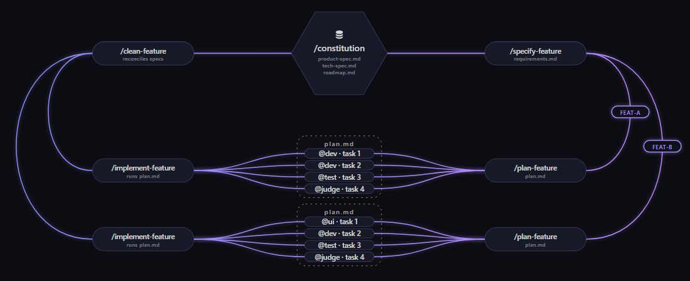

<p align="center">
  <picture>
    <source media="(prefers-color-scheme: dark)" srcset="assets/logo-dark.png">
    <source media="(prefers-color-scheme: light)" srcset="assets/logo-light.png">
    
  </picture>
</p>

<p align="center">
  <strong>Pasa del vibe coding al Spec-Driven Development. Orquesta bucles agénticos con un catálogo de skills y subagentes listo para copiar y pegar, sin instalación.</strong>
</p>

<p align="center">
  
</p>

<p align="center">
  
  
  
  
</p>

<p align="center">
  🌐 <a href="README.md">English</a> · <strong>Español</strong>
</p>

<p align="center">
  
</p>

<p align="center">
  My AIsy Toolkit reúne skills y subagentes listos para instalar en tu repositorio y empezar a desarrollar con Spec-Driven Development y bucles agénticos, compatible con Claude Code y Codex CLI en modo best-effort. Apunta tu agente a una URL (o pega un archivo), y cualquier repositorio obtiene el mismo catálogo de comandos y subagentes, listo para usar, sin librerías, sin gestores de paquetes, sin nada que instalar globalmente.
</p>

---

## ⚡ Instalación rápida

Desde dentro del repositorio que quieres configurar, pega esto en la conversación de tu agente:

```
Fetch and follow the setup instructions at https://raw.githubusercontent.com/charlstown/my-aisy-toolkit/main/setup-ai.md
```

Tu agente descarga el archivo, sigue los pasos que contiene y te cuenta qué instaló. No hay nada que descargar, ningún gestor de paquetes y ningún script que ejecutar. Los efectos secundarios se limitan a los archivos escritos dentro de `.claude/` y/o `.codex/` en tu repositorio, salvo un único archivo del launcher global que el instalador puede ofrecer guardar al final — solo si dices que sí.

---

### Instalación por terminal

¿Prefieres la terminal? Pásalo directamente como prompt al arrancar el agente:

```
claude "Fetch and follow the setup instructions at https://raw.githubusercontent.com/charlstown/my-aisy-toolkit/main/setup-ai.md"
```

```
codex "Fetch and follow the setup instructions at https://raw.githubusercontent.com/charlstown/my-aisy-toolkit/main/setup-ai.md"
```

## 📦 ¿Qué vas a encontrar aquí?

- **15 skills** en total: 10 que cubren todo el flujo dirigido por especificaciones (perfil `default`), +2 para una pasada dedicada de UI/UX (perfil `ui-ux`), +3 opcionales independientes (pack `utils`)
- **6 subagentes** para arquitectura, implementación, testing, UI y revisión
- **2 perfiles de catálogo**: `default` y `ui-ux` (añade `/aisy.ui-spec` y `/aisy.clarify-uix`)
- **1 pack de skills opcional**: `utils` (`/aisy.digest`, `/aisy.grill-me`, `/aisy.for-dummies`), instalable sobre cualquier perfil
- **1 método de instalación**: una URL o un archivo pegado, nada que descargar
- **2 agentes de código IA** soportados: Claude Code y Codex CLI, cada uno con sus artefactos nativos

Y el catálogo sigue creciendo a medida que se añaden nuevas skills y agentes.

## 🔁 Cómo funciona

Apunta tu agente a la URL de instalación una sola vez, ese es el único paso de instalación. `/aisy.constitution` arranca las specs (product-spec, tech-spec, roadmap) y a partir de ahí cada feature pasa por el mismo ciclo cerrado: `/aisy.specify-feature` la acota, `/aisy.clarify-feature` cierra los huecos de decisión pendientes, `/aisy.plan-feature` la descompone, `/aisy.implement-feature` la construye y `/aisy.clean-feature` cierra el ciclo alineando de nuevo las specs antes de que empiece la siguiente feature.

## 📚 Catálogo: perfil default

**Skills**

| Skill | Qué hace |
|-------|----------|
| `/aisy.constitution` | Encadena product-spec y tech-spec para arrancar las specs raíz de un proyecto. |
| `/aisy.product-spec` | Genera o actualiza `specs/product-spec.md` entrevistando al usuario. |
| `/aisy.tech-spec` | Genera o actualiza `specs/tech-spec.md` (el cómo técnico) a partir del product-spec. |
| `/aisy.roadmap` | Genera `specs/roadmap.md` a partir del product-spec y el tech-spec. |
| `/aisy.new-issue` | Abre un issue de bug o feature en GitHub, investigando o clarificando según el tipo. |
| `/aisy.specify-feature` | Detecta features a partir de varias fuentes (incluyendo issues abiertos de GitHub) y crea un `requirements.md` por cada una. |
| `/aisy.clarify-feature` | Cierra los huecos de decisión pendientes en uno o varios `requirements.md`. |
| `/aisy.plan-feature` | Genera `plan.md` a partir de un `requirements.md`, asignando tareas a subagentes. |
| `/aisy.implement-feature` | Orquesta la ejecución de uno o varios `plan.md` usando git worktrees. |
| `/aisy.clean-feature` | Alinea las specs raíz con el trabajo completado y cierra el issue asociado. |

**Agentes** (subagentes de Claude Code)

| Agente | Rol |
|--------|-----|
| `architect` | Descubrimiento, evaluación de alternativas y diseño de la solución antes de implementar. |
| `code-developer` | Implementa código de aplicación a partir de un plan ya definido. |
| `test-developer` | Escribe tests (no los ejecuta). |
| `tester` | Ejecuta los tests y verifica el comportamiento real de la aplicación. |
| `ui-developer` | Diseña e implementa pantallas completas (HTML/CSS/TS/React). |
| `judge` | Revisa el trabajo de otros agentes y emite un veredicto PASS / CHANGES_REQUESTED. |

> [!note] Codex CLI
> Las skills son compartidas y se copian literalmente a `.agents/skills/`; los agentes Codex se instalan desde artefactos `.toml` nativos en `.codex/agents/`.

## 🎨 Catálogo: perfil `ui-ux`

Todo lo del perfil `default`, más dos skills para una pasada dedicada de UI/UX (12 skills en total, los mismos 6 agentes):

| Skill | Qué hace |
|-------|----------|
| `/aisy.ui-spec` | Entrevista de arriba a abajo (estructura de contenido → layout → interacción/estados → dispositivos/accesibilidad) para diseñar una pantalla, con mockups del concepto y una pasada de autocrítica, y escribe `specs/ui-spec.md`. |
| `/aisy.clarify-uix` | La contraparte de UI/UX de `/aisy.clarify-feature`: lanza una ronda de arriba a abajo de preguntas de UI/UX (4, 8 o 12) y vuelca las respuestas en `requirements.md`. |

## 🧰 Pack opcional: `utils`

Skills independientes que no pertenecen a ningún perfil — instalables sobre `default` o `ui-ux`:

| Skill | Qué hace |
|-------|----------|
| `/aisy.digest` | Convierte una duda vaga en un interrogatorio corto, una investigación web breve y una recomendación con una alternativa. |
| `/aisy.grill-me` | Interroga críticamente un documento para cerrar huecos e inconsistencias, y luego lo reescribe con lo aprendido. |
| `/aisy.for-dummies` | Explica uno o varios conceptos a partir de un prompt, enlace o documento como un profesor experto, con ejemplos y recursos opcionales. |

## 🗂️ Estructura del proyecto

Solo las piezas que le importan a alguien decidiendo si instalar o no:

```
my-aisy-toolkit/
├── ai-toolkit/
│   ├── default/
│   │   ├── commands/    # 10 skills
│   │   └── agents/      # 6 subagentes
│   ├── ui-ux/
│   │   └── commands/    # +2 skills (ui-spec, clarify-uix)
│   └── utils/
│       └── commands/    # +3 skills opcionales (digest, grill-me, for-dummies)
├── catalog.yaml
├── setup-ai.md
└── README.md
```

## 📝 Cosas a saber

**Reinstalar o actualizar.** Volver a ejecutar cualquiera de los dos métodos de instalación en un repositorio que ya tiene el kit trae la última versión del catálogo, añade las skills o agentes nuevos desde tu última instalación y actualiza los que hayan cambiado. No hay versionado semántico que rastrear. Siempre acabas en el catálogo actual.

**Parámetros**

| Parámetro | Tipo | Por defecto | Descripción |
|-------|------|---------|--------------|
| `profile` | string | `default` | Perfil del catálogo a instalar. Si hay más de uno disponible y no se especifica ninguno, tu agente pregunta cuál quieres. |
| `agent` | string | preguntado | Agente IA destino (`claude`, `codex`). Siempre se pregunta explícitamente, nunca se infiere de las carpetas que ya haya en tu repositorio. |
| pack utils | boolean | preguntado | Si añadir las skills opcionales de `utils` sobre el perfil elegido. Solo se pregunta cuando el catálogo declara una sección `packs.utils`. |

Los efectos secundarios se limitan a `.claude/` y/o `.codex/` en tu repositorio, salvo un único archivo del launcher global que el instalador puede ofrecer guardar al final — solo si dices que sí. El código de la aplicación y todo lo demás en tu repositorio se deja intacto.

## 🤝 Código de conducta

Este proyecto sigue un [Código de conducta](CODE_OF_CONDUCT.md). Al participar, se espera que lo respetes.
