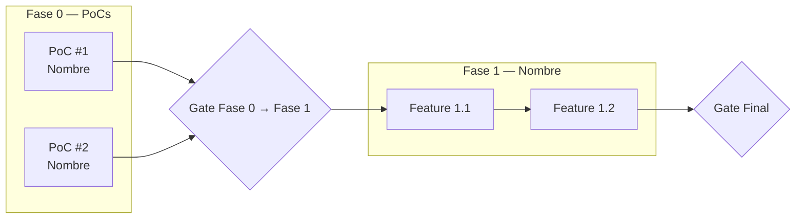
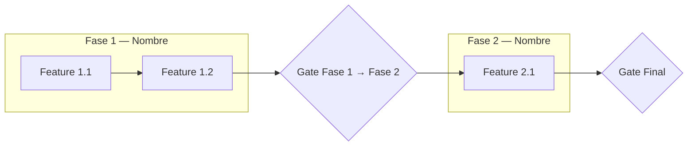

## Language

Detect the language of the user's initial (or most recent) message and conduct the ENTIRE interaction in that language — every `AskUserQuestion` prompt, header, option label and description, and every message, summary, and generated file or output. Mirror the user's language exactly and never switch to another language. These instructions are written in English, but that must NOT force the interaction into English: if the user wrote in Spanish, ask and write in Spanish; if they wrote in another language, use that one. The language of the inputs determines the language of the outputs.

---

## Purpose

Translate the what (ProductSpec) and the how (TechSpec) into an ordered execution plan: what gets built, in what order, and with what closing criteria. The result is a single `specs/roadmap.md` file that shows dependencies, phases, and gates with enough precision to guide development without becoming a project plan with exact estimates.

The roadmap does NOT repeat the ProductSpec's vision or the TechSpec's stack. It focuses exclusively on the **execution order** and the **acceptance criteria**.

---

## Execution protocol

### Phase 0 — Reading the existing context

Read the following files in **parallel** (skip the ones that don't exist):

- `specs/product-spec.md` — vision, deliverables, design principles, and out of scope
- `specs/tech-spec.md` — stack, architecture, ADRs and, if they exist, PoCs with their hypotheses and success criteria
- `specs/roadmap.md` — if there is already a previous roadmap, extend it instead of replacing it
- `README.md` — project name, description, and current status

Build a mental map of:

- **PoCs detected in TechSpec**: is there a PoCs section with explicit hypotheses and success criteria? If yes → the roadmap includes a Phase 0 of PoCs. If no → only feature phases.
- **Features or deliverables**: listed in the ProductSpec (interfaces, operations, modules) and in the TechSpec (modules, schema, integrations).
- **Obvious dependencies**: which feature cannot start without another, which PoC blocks which feature.
- **Natural gates**: closing criteria mentioned in both specs (scoring thresholds, test coverage, machines solved, etc.).
- **Explicit out of scope**: what is declared in `## 🚫 Out of Scope` or `## 🔮 Future` of both specs.

Do not share this analysis with the user. Use it to generate concrete options in the questions.

---

### Phase 1 — Brief interview

Show the user this table in markdown text:

```
The roadmap is generated through 3 key questions:

| Question | Category         | What it determines                                    |
|----------|------------------|-------------------------------------------------------|
| 1        | Phases and structure | Number of phases/tiers of features and how they group |
| 2        | Tracking           | Issue system and whether there are already open issues |
| 3        | Gates and closing  | Acceptance criterion of each phase and of the milestone |
```

Then launch the 3 questions in a **strictly sequential** way (one at a time):

---

#### Question 1 — Phases and structure

Use `AskUserQuestion`:

```
AskUserQuestion:
  question: "How do you want to organize the features into phases?"
  header: "Phases"
  options:
    - label: By increasing complexity (Tier 0 → Tier 1 → Tier 2)
      description: Each tier adds tools or capabilities on top of the previous one. The advancement criterion is to pass the previous tier.
    - label: By product milestone (Alpha · Beta · GA)
      description: Each phase delivers something usable externally. The advancement criterion is validation with real users.
    - label: A single feature phase
      description: The project is small enough not to need sub-phases. All features go into a single prioritized list.
```

---

#### Question 2 — Tracking

Use `AskUserQuestion`:

```
AskUserQuestion:
  question: "What tracking system do you use for the project's issues?"
  header: "Tracking"
  options:
    - label: GitHub Issues
      description: Features and PoCs will link to GitHub issues. I add a tracking table at the beginning of the roadmap.
    - label: Linear
      description: Features and PoCs will link to Linear tickets. I add a tracking table at the beginning of the roadmap.
    - label: No external tracking
      description: There is no linked issue system. Features are left without a tracking link.
```

---

#### Question 3 — Gates

Use `AskUserQuestion`:

```
AskUserQuestion:
  question: "What is the closing criterion of a phase to advance to the next one?"
  header: "Gates"
  options:
    - label: Reproducible E2E test on the main use case
      description: The phase closes when there is an automated end-to-end test covering the happy path.
    - label: Manual smoke against the real environment
      description: The phase closes when a human runs the complete flow in staging/production without errors.
    - label: Business criterion (scoring, metrics, users)
      description: The phase closes when a concrete threshold is reached: minimum score, success rate, active users, etc.
```

---

### Phase 2 — Summary before writing

Show a table summary of the decisions collected:

```
## Session summary

| Area              | Decision                              | Status     |
|-------------------|---------------------------------------|------------|
| Feature phases    | <chosen structure>                    | ✅ Defined |
| Tracking          | <issue system>                        | ✅ Defined |
| Phase gate        | <closing criterion>                   | ✅ Defined |
| Detected PoCs     | <n PoCs / no PoCs>                    | ✅ Defined |
```

Then use `AskUserQuestion` to confirm the writing:

```
AskUserQuestion:
  question: "Shall I proceed to write specs/roadmap.md with this structure?"
  header: "Writing"
  options:
    - label: Yes, generate now
      description: I generate the complete roadmap with the RMAP template and all the decisions made.
    - label: I want to adjust an answer
      description: Before writing, I go back to a specific question to change the decision.
    - label: Skeleton only
      description: I generate only the structure with empty sections and TBD. I will fill it in manually.
```

---

### Phase 3 — Writing `specs/roadmap.md`

Generate the file following **exactly this order of sections**. Omit the PoCs section if no PoCs were detected in the TechSpec. Mark any undetermined field with `—` or *TBD*.

---

#### Metadata callout

```
> [!abstract] Metadata
> | | |
> |---|---|
> | **Status** | 🟡 Draft |
> | **Owner** | <owner from ProductSpec or context> |
> | **Created** | <today YYYY-MM-DD> |
> | **Updated** | <today YYYY-MM-DD> |
> | **Version** | v0.1 |
> | **Parent specs** | [[product-spec]] · [[tech-spec]] |
> | **Scope** | <one sentence describing the plan's scope: PoCs + Phases, or just Phases> |
```

---

#### `## 🔗 Tracking` *(only if the user uses external tracking)*

Table of issues linked to the roadmap. One row per PoC (if any) and one row per phase or main epic:

```
| Item | Issue |
|---|---|
| PoC #N — Name | [#N](url) |
| Phase N — Epic name | [#N](url) |
```

If the issues have not been created yet, leave the Issue cell as `—` for the user to fill in.

---

#### `## 🎯 Vision`

1-3 sentences describing the **execution plan**, not the product. Include: how many phases there are, whether there are prior PoCs that block the start, and what the final milestone enables. Do not repeat the ProductSpec's vision.

---

#### `## 📊 Overview`

A **Mermaid flowchart diagram** showing the plan's topology:

- If there are PoCs: subgraph of PoCs → Gate Phase 0 → subgraph of feature phases.
- If there are no PoCs: subgraph of feature phases with dependencies between them.
- Include the Gate nodes between phases.

Example structure with PoCs:



Example structure without PoCs:



---

#### `## 🧪 Phase 0 — Proof of Concepts` *(only if the TechSpec has PoCs)*

Introductory paragraph: how many PoCs there are, whether they are parallelizable with each other or have dependencies, and why they block the start of the feature phases.

If the TechSpec includes a callout with the canonical deliverable of all the PoCs (e.g. `tech-spec.md`, `report.md`, `driver.md`), replicate it in a `> [!abstract] Common deliverable` callout.

For each PoC detected in the TechSpec, write a subsection with:

```
### PoC #N — Name `[P]`

- **Issue** — [#N](url) *(or — if there is no issue yet)*
- **Hypothesis** — What is being validated or refuted.
- **Functional design** — How the experiment is implemented concretely.
- **Setup** — Prerequisites, environment, input data.
- **Success criteria**
  - Measurable criterion 1
  - Measurable criterion 2
- **Closing decision** — Which ADR or architectural decision this PoC resolves.
- **Output** — Artifacts delivered when the PoC closes (repo, docs, benchmarks).
- **Estimate** — Range of days.
```

Extract these fields from the TechSpec. If the TechSpec does not have them explicitly, infer them from the PoC's description and mark the inferred fields with *(inferred)*.

Close the section with:

> [!info] Parallelization
> Indicate which PoCs are independent of each other and which have dependencies, with the justification.

---

#### `## 🚀 Phase N — Name` *(one section per feature phase)*

Introductory paragraph with the catalog of tools or capabilities that this phase adds on top of the previous one.

Table of features for the phase:

```
| # | Feature | Depends on | Notes |
|---|---|---|---|
| FN.1 | Feature name | — or FN.X, PoC #X | Brief note if applicable |
| FN.2 | Feature name | FN.1 | |
```

Rules for populating the table:
- Feature IDs follow the pattern `FN.X` where `N` is the phase number (0, 1, 2...).
- **Depends on**: reference the ID of another feature or the number of the PoC that must be closed before starting.
- Features come from the TechSpec's modules, the ProductSpec's interfaces, and the deliverables of both docs. Do not invent features that are not in the specs.
- If a feature has no clear dependencies, use `—`.
- If the phase is the first (or only) one and there are PoCs, mark dependencies to the relevant PoCs.

Close the section with the **phase closing criterion**:

```
**Phase N closing criterion** — Description of the gate in concrete and verifiable terms.
```

---

#### `## 🔗 Dependency Graph`

A second **Mermaid flowchart diagram**, more detailed than the Overview, showing:
- The PoCs (if any) and their dependencies on each other.
- The most critical features of each phase and their dependencies on PoCs and other features.
- Do not include all features: only those that have non-obvious dependencies.

---

#### `## ✅ Gates`

One subsection for each gate of the plan:

```
### Gate [Gate name]

List of conditions that must be met simultaneously to consider the gate closed. Each condition is verifiable without ambiguity: a test passes, a metric is reached, an artifact exists.
```

At least one phase-to-phase gate and one final milestone gate (MVP → VP, Alpha → Beta, etc.).

---

#### `## 🚫 Out of Roadmap`

List of elements that are explicitly outside this roadmap. Extract from `## 🚫 Out of Scope` and `## 🔮 Future` of the ProductSpec and TechSpec. Group by category if there are more than 5 items.

- **Name** — Why it is not part of this roadmap (out of scope, future, or already covered by another document).

---

### Phase 4 — Next step

Show this block only when the run finished successfully, meaning `specs/roadmap.md` was actually written and the Phase 2 confirmation was accepted. If the run ended any other way (the confirmation was rejected or there was nothing to plan), show nothing: no block, no next step line.

Then close with:

```
✅ Done. Suggested next step:

🎯 /specify-feature to turn what you want to build next into a feature spec.
```

Write the block in the user's language, following the `## Language` section at the top of this file. Keep the skill name (`/specify-feature`) and the emoji exactly as it is, only the words around it get translated.

This block only suggests. Do not run the suggested skill yourself and do not chain into it: stop here and wait for the user to invoke it.

---

## Constraints

- **Do not invent features.** All features come from the TechSpec's modules, the ProductSpec's interfaces, or the deliverables of both. If a module or interface has no associated feature, create only the module's bootstrapping feature.
- **Do not invent PoCs.** Only include a Phase 0 if the TechSpec explicitly has a PoCs section with hypotheses.
- **Mermaid for all diagrams.** No ASCII art.
- **Output is a single file** `specs/roadmap.md`. No subdirectories or additional files.
- **The roadmap does not repeat the ProductSpec or the TechSpec.** If a field is not in the specs, mark it as *TBD* and note which spec should complete it.
- **Write in the same language** as the specs read.
- **No invented estimates.** Only include time estimates if the TechSpec has them explicitly. If not, omit the `Estimate` field from the PoCs.
- **Obsidian conventions:** no H1, hierarchy from H2. Wikilinks `[[product-spec]]`, `[[tech-spec]]`. Do not use em dashes; use commas or semicolons. Pending items in italics: *TBD*.
