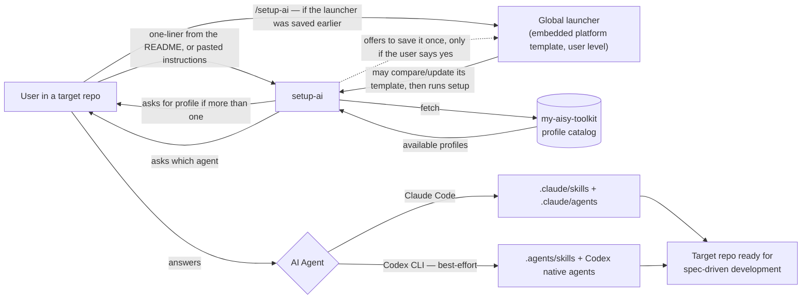

> [!abstract] Metadata
> | | |
> |---|---|
> | **Status** | 🟡 Draft |
> | **Owner** | Carlos |
> | **Created** | 2026-08-01 |
> | **Updated** | 2026-08-07 |
> | **Version** | v0.1 |

## 🎯 Vision

> **Current catalog architecture.** Distributable skills have one shared source at `ai-toolkit/skills/<name>/SKILL.md`. Claude and Codex install that same file literally into their respective skill destinations. Their agents are native, separate artifacts under `ai-toolkit/agents/claude/` and `ai-toolkit/agents/codex/`; `catalog.yaml` declares every installed path explicitly. This architecture supersedes earlier descriptions of runtime translation.

**My AIsy Toolkit** is a distributable kit of skills and subagents for spec-driven development with AI coding agents (Claude Code, and in best-effort mode Codex CLI), installable in any repository with a one-liner or by pasting plain text — no libraries, no package managers, no friction.

## 🔥 Problem Statement

| Pain | Root Cause |
|------|-----------|
| Reproducing the same set of skills/agents in every new repo means copying `.claude/` folders by hand | There is no centralized distribution mechanism; every repo keeps its own copy, which drifts out of sync over time |
| Spec-driven development flows (product-spec, tech-spec, roadmap, plan-feature, implement-feature...) get reinvented project by project | There is no standard, versioned, reusable catalog in a single place |
| Installing AI tooling in a repo usually drags in dependencies, package managers, and configuration | Existing solutions (plugins, npm packages, marketplaces) add friction and failure surface |
| Every AI coding agent (Claude Code, Codex CLI...) expects its skills and agents in different native locations and formats | There is no installation layer that copies a shared skills source and native agent artifacts to each agent's destinations |

## 👤 Target User

- 🎯 **Primary** — Carlos, owner of the multi-repo vault: needs to replicate his set of Claude Code skills/agents in any new repo without copying folders by hand or maintaining different versions in each place.
- 👥 **Secondary** — Devs using Claude Code (and, in best-effort mode, Codex CLI) who want to adopt spec-driven development with AI agents without designing their own skills from scratch.
- 🌍 **Stretch** — Teams starting a new repository who want a standard starting point (specs, roadmap, agents) instead of improvising their own flow.

## 💎 Design Principles

- **Zero dependencies / zero friction** — installation via a one-liner fetch or by pasting plain text into any agent. No package manager, no library, and nothing to install globally beyond a single optional `/setup-ai` launcher that the user has to say yes to.
- **README as product** — the README is the kit's "front": it must convince and allow installing in under 2 minutes. It is treated as the main piece, not an afterthought.
- **Extensible profiles from day one** — the catalog now ships two profiles, `default` and `ui-ux` (a superset of `default`'s catalog plus the `ui-spec` and `clarify-uix` skills), and the installation mechanism detects and asks about available profiles without needing a redesign when more are added.
- **Multi-agent by shared skills and native agents** — every supported agent receives the same literal skill source at its native skills path, while its agents remain native artifacts (`.md` for Claude Code and `.toml` for Codex), without runtime translation.
- **Deliberately vendor-agnostic delivery** — the kit is distributed as plain-text instructions fetched over plain HTTPS, never published to a single vendor's proprietary channel (e.g. the Claude Code plugin/marketplace system, see ADR-007 in tech-spec.md). This is a conscious tradeoff, not an oversight: it keeps the same one-liner/copy-paste mechanism usable by any AI agent capable of fetching and following instructions, so support can extend to more providers over time (today Claude Code and Codex CLI) without being tied to, or gated by, any one agent's ecosystem.
- **Direct, jargon-free tone** — installer messages, README, and skill names are clear, short, and have a light, easygoing touch ("Keep it AIsy"), never sounding corporate.
- **Always the latest version** — no semantic versioning or release tags for *catalog distribution*: installing or re-installing always brings the current state of the catalog's main branch, with no version selection for the end user. (The repo itself is versioned via git tags `vX.Y.Z` only — there is no `VERSION` file — computed and pushed automatically on merge to `main` from the PR title's prefix (`release:`/`feature:`/`fix:`/`chore:`, per CLAUDE.md); see ADR-006 in tech-spec.md. That versioning is decoupled from, and does not affect, how the catalog gets installed.) The optional global launcher embeds its platform template: when run, it may download the template from `setup-ai.md`, compares it with its own content, updates only when it differs, and continues the installation if that update fails.

## 🏗️ Architecture



- **User** — starts the installation from the repo where they want the kit, by one of two routes: the one-liner from the README, or the global `/setup-ai` launcher if they saved it in an earlier install. Picks a profile if asked. Does not interact directly with the `my-aisy-toolkit` repo.
- **setup-ai** — entry point (instructions/script) that fetches the catalog, always asks the user which AI agent to target (never inferred from the target repo's structure), asks for the profile only if the catalog declares more than one, and writes the corresponding files into the target repo. Skills are copied literally from `ai-toolkit/skills/<name>/SKILL.md` to `.claude/skills/<name>/SKILL.md` or `.agents/skills/<name>/SKILL.md`; agents are copied from `ai-toolkit/agents/claude/*.md` and `ai-toolkit/agents/codex/*.toml` to their native destinations. Both routes land here and run the exact same steps.
- **Global launcher (`/setup-ai`)** — optional shortcut, saved once at user level and living outside any repo. It contains the platform template. On execution it may download the current template from `setup-ai.md`, compares it, updates itself only if different, and continues with the embedded installation flow if the check or update fails. `setup-ai` offers it at the end of an install only with the user's explicit yes, and reports any unavailable candidate or write failure without reverting the completed catalog install.
- **my-aisy-toolkit (catalog)** — single source of truth: shared skills under `/ai-toolkit/skills/<name>/SKILL.md` and separate native agents under `/ai-toolkit/agents/claude/*.md` and `/ai-toolkit/agents/codex/*.toml`; `catalog.yaml` declares their installed paths. It does not execute itself; it only serves content for `setup-ai` to consume. This is decoupled from the repo's own internal `.claude/` folder, which is used only to develop this toolkit itself (dogfooding) and is never what gets installed into a target repo.
- **Target repo** — receives the installed files and becomes operational for spec-driven development through the corresponding AI agent's skills. Each skill/agent's internal logic lives in its own self-documented file.

## 🛠️ Interfaces

### Installation

#### One-liner (fetch of `setup-ai`)

Single command the user pastes into their terminal (or asks their agent to run) inside the target repo.

| Param | Type | Default | Description |
|-------|------|---------|--------------|
| `profile` | string | `default` | Catalog profile to install. If more than one is available and none is specified, `setup-ai` asks the user. |
| `agent` | string | asked | Target AI agent (`claude`, `codex`). Always asked explicitly; never inferred from the target repo's structure (`.claude/`, `.codex/`). |

> [!warning] Side effect
> Writes/overwrites files inside `.claude/` and/or `.codex/` in the target repo. Does not touch application code or other folders. **One opt-in exception:** at the end of the install, `setup-ai` may offer to save the global launcher — a **single** file in the agent's user-level command directory — and writes it only if the user explicitly says yes. Without that yes, nothing outside the target repo is touched, and nothing in the user's home is ever overwritten, moved, or deleted. **Also:** if the catalog declares `packs.utils`, `setup-ai` additionally asks a non-blocking Utils question (reply by number(s), "all", or blank) to optionally install additional `aisy.`-prefixed skills, independent of the chosen profile.

#### Copy-paste (plain instructions)

Plain-text block the user pastes directly into the conversation of any AI coding agent, without running any script. The agent interprets the instructions and performs the installation itself (reads the catalog, writes the files).

| Param | Type | Default | Description |
|-------|------|---------|--------------|
| `profile` | string | `default` | Same as the one-liner; the agent asks if it's not specified and several profiles exist. |

#### Global launcher (`/setup-ai`)

Optional shortcut so the user never has to go back to the README. It is an embedded platform-specific `setup-ai` template. Each execution may download the matching template from `setup-ai.md`, compares it with the local launcher, updates only when it differs, then continues the setup; a failed check or update never blocks setup.

| Agent | Where it's saved | How it's invoked |
|-------|------------------|------------------|
| Claude Code | `~/.claude/commands/setup-ai.md` | `/setup-ai` (optional `[profile]` argument) |
| Codex CLI — best-effort | `~/.agents/skills/setup-ai/SKILL.md` | `$setup-ai` — a `$` skill, not a slash command |

> The Codex row is best-effort like the rest of Codex support: its native skills location is `.agents/skills/`, and the command is `$setup-ai`, never `/setup-ai`.

How it gets there:

- **Only with an explicit yes.** `setup-ai` asks once, at the very end, after the repo is already set up. A no, a silence, or an ambiguous answer are all treated as no, and nothing outside the repo is written.
- **Confirmed-agent-first, environment-checked.** The agent confirmed in Step 1 is always the starting candidate for the offer. The directory-existence check (`~/.claude/`, `~/.codex/` or `~/.agents/`) decides whether that confirmed agent's candidacy survives and whether the other agent joins as an additional candidate. If the confirmed agent is dropped because its user-level directory genuinely does not exist, `setup-ai` says so explicitly in that same turn. This environment check is only about the launcher — it never replaces the mandatory "which agent am I setting this up for?" question, which is always asked.
- **Safe template refresh.** If a launcher already exists, it is retained when it matches the downloaded platform template; when it differs, the launcher may update it before continuing. A refresh failure is reported but never prevents the catalog installation.
- **Never blocking.** If the write fails (permissions, no home directory, disk), the catalog install already finished and is not reverted — the user just gets the reason in the wrap-up report.

> [!warning] Side effect
> This is the only file the kit ever writes outside the target repo, and only after the user says yes.

#### Re-installation / update

Running any of the methods above on a repo that already has the kit installed. Always brings the latest version of the catalog (no semantic versioning), adds new skills/agents from the profile, and updates existing ones that changed.

### Catalog — profiles

#### `default` profile

**Skills**

| Skill | What it does |
|-------|----------|
| `/constitution` | Kicks off product-spec, tech-spec, and roadmap in sequence to bootstrap a project's root specs. |
| `/product-spec` | Generates or updates `specs/product-spec.md` by interviewing the user. |
| `/tech-spec` | Generates or updates `specs/tech-spec.md` (the technical how) from the product-spec. |
| `/roadmap` | Generates `specs/roadmap.md` from the product-spec and tech-spec. |
| `/new-issue` | Opens a bug or feature issue on GitHub, investigating or clarifying depending on type. |
| `/specify-feature` | Detects features from various sources (including open GitHub issues) and scaffolds a `requirements.md` per feature. |
| `/clarify-feature` | Closes the pending decision gaps in one or more `requirements.md` files. |
| `/plan-feature` | Generates `plan.md` from a `requirements.md`, attributing tasks to subagents. |
| `/implement-feature` | Orchestrates the execution of one or more `plan.md` files using git worktrees. |
| `/clean-feature` | Aligns the root specs with completed work and closes the associated issue. |

**Agents (Claude Code subagents)**

| Agent | Role |
|--------|-----|
| `architect` | Discovery, evaluation of alternatives, and solution design before implementing. |
| `code-developer` | Implements application code from an already-defined plan. |
| `test-developer` | Writes tests (does not run them). |
| `tester` | Runs tests and verifies the application's real behavior. |
| `ui-developer` | Designs and implements complete screens (HTML/CSS/TS/React). |
| `judge` | Reviews other agents' work and issues a PASS / CHANGES_REQUESTED verdict. |

> Codex CLI receives the same skills copied literally to `.agents/skills/<name>/SKILL.md` and its native agent artifacts from `ai-toolkit/agents/codex/*.toml`; Claude Code receives literal skills in `.claude/skills/<name>/SKILL.md` and `ai-toolkit/agents/claude/*.md` in its native agents location.

#### `ui-ux` profile

Superset of `default`'s 10 skills and 6 agents, plus:

| Skill | What it does |
|-------|----------|
| `/ui-spec` | Interviews the user top-down about a UI screen (content structure → layout → interaction/states → devices/accessibility) and writes/updates `specs/ui-spec.md` in the target repo. |
| `/clarify-uix` | UI/UX counterpart to `/clarify-feature`; lets the user pick 4/8/12 questions (one marked "recommended") before running the interrogation in the same staged style as `/ui-spec`. |

Agents: identical to `default`'s 6 agents — no new agent introduced.

Across shared skills, Claude Code preserves each skill's own questioning flow. In Codex, each turn presents exactly one pending question, with identifiable options and an explicit invitation to answer with an option or free text; unresolved free-text decisions are recorded as gaps and only independent work continues. If Codex has no native question tool, the skill uses conversational fallback. When applicable, prompts use the language of the user's latest message.

### Catalog — Utils pack (optional)

`packs.utils` is an optional, non-profile group of skills, independent of the chosen profile. It is asked as a single non-blocking question during install only if the catalog declares a `packs.utils` section; its literal shared files get an `aisy.` prefix at `.claude/skills/aisy.<skill>/SKILL.md` or `.agents/skills/aisy.<skill>/SKILL.md` to avoid collisions with the user's own skills.

| Skill | What it does |
|-------|----------|
| `digest` | From a vague user prompt (a doubt, a fear, or a reflection), runs a short interrogation (max 3 questions) to narrow down what and how to research, does brief internet research on trends, articles, or documents related to the topic, and always closes with at least 1 recommendation and 1 alternative (option B), justifying the reasoning behind the recommended decision. |
| `grill-me` | Critical interrogation of a document to reduce gaps, clarify decisions, and detect inconsistencies. When finished, rewrites the document with everything learned. Requires an input document. |
| `for-dummies` | Explains one or more concepts from a vague prompt, link, or document like an expert teacher, with examples and up to 3 optional free resources per concept. |

## 🩺 Operations

**Healthcheck**

Verifying the installation means checking that the expected files for the installed profile exist: `.claude/skills/*/SKILL.md` and `.claude/agents/*.md` for Claude Code, or `.agents/skills/*/SKILL.md` and the installed Codex native `*.toml` agents for Codex. There is no running process or endpoint to query — it's a file-presence check.

**Logging**

`setup-ai` does not generate persistent logs. It prints to stdout which skills/agents it installed, which it updated, and which were already up to date during execution.

## 📦 Deliverables

| Deliverable | Description |
|:-----------:|-------------|
| 💻 **Catalog (source code)** | Shared skills at `/ai-toolkit/skills/<name>/SKILL.md`, copied literally to each platform's skills directory; native agents at `/ai-toolkit/agents/claude/*.md` and `/ai-toolkit/agents/codex/*.toml`; `catalog.yaml` declares profile membership and every destination path. The optional Utils skills use the same shared-skill structure and `aisy.` destination prefix. |
| 🛠️ **setup-ai** | Installation instructions/script: one-liner method and copy-paste method. |
| 📚 **README** | Presents the kit, installation instructions (both methods), the `default` profile catalog, and a quick usage guide. |

## 🗂️ Project Structure

> [!abstract]- File tree
> ```
> my-aisy-toolkit/
> ├── .claude/             # Internal only: this repo's own Claude Code setup, used to develop the toolkit itself (not distributed)
> │   ├── commands/
> │   └── agents/
> ├── ai-toolkit/
> │   ├── skills/          # One shared source per skill
> │   │   └── <name>/SKILL.md
> │   ├── agents/
> │   │   ├── claude/      # Native Claude Code agent (*.md)
> │   │   └── codex/       # Native Codex agent (*.toml)
> │   └── catalog.yaml     # Profile membership and installed destinations
> ├── specs/               # product-spec.md, tech-spec.md, roadmap.md for this repo itself
> ├── setup-ai.md          # Plain-text installation instructions (root)
> └── README.md            # Project front: installation, catalog, usage
> ```

## 🚫 Out of Scope

- **Exhaustive documentation of each skill/agent's internal behavior** — this ProductSpec lists the catalog, but each skill's detailed behavior lives in its own self-documented file.
- **Support for AI agents other than Claude Code and Codex CLI** (Devin, Cursor, Windsurf, etc.) — a conscious decision by the user; a possible future extension.
- **Granular version management or rollback per individual skill** — the installer always brings the latest version of the full profile; there is no selective install or reverting to previous versions.
- **Additional profiles beyond `default` and `ui-ux`** — the mechanism must support them, but their concrete content is not defined in this ProductSpec.

## 🔮 Future

- **Additional profiles** — profiles beyond `default` and `ui-ux` (e.g. `minimal`, `frontend-only`) for different project types or team preferences.
- **Verified Codex CLI support** — move from best-effort to tested support in a real Codex environment.
- **Support for other AI agents** — evaluate Devin, Cursor, Windsurf or others under the same adaptation layer.
- **Catalog version notifications** — notify when the target repo has an outdated version of the installed catalog.

## ❓ Discovery

- [x] ~~Is Codex CLI supported in v1?~~ → Yes, in best-effort mode: shared skills are copied literally to `.agents/skills/` and Codex agents use native `.toml` artifacts, documented as unverified in a real environment until it can be tested.
- [x] ~~How is the catalog versioned?~~ → Catalog *distribution* always brings the latest of the main branch; no semantic versioning or version selection there. Separately, the repo itself is now SemVer-tagged automatically: merging a PR to `main` computes and pushes the next `vX.Y.Z` git tag from the PR title prefix (`release:`/`feature:`/`fix:`/`chore:`, enforced by a required precheck — see CLAUDE.md and ADR-006 in tech-spec.md); there is no `VERSION` file, the git tag is the sole source of truth. The two are independent: bumping the repo version never changes what `setup-ai` installs.
- [x] ~~Tone for user-facing content?~~ → Direct, jargon-free, with a light easygoing touch ("Keep it AIsy").
- [x] ~~Exact location of the `setup-ai` script/instructions within the repo?~~ → Repo root (`setup-ai.md`), per tech-spec.md.
- [x] ~~Concrete mechanism for profile and active-agent selection?~~ → ADR-004: the agent is always asked explicitly (never inferred/detected from folders present); the profile is asked only if the catalog declares more than one.
