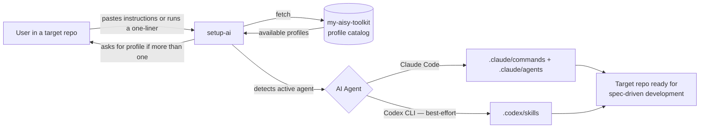

> [!abstract] Metadata
> | | |
> |---|---|
> | **Status** | 🟡 Draft |
> | **Owner** | Carlos |
> | **Created** | 2026-08-01 |
> | **Updated** | 2026-08-01 |
> | **Version** | v0.1 |

## 🎯 Vision

**My AIsy Toolkit** is a distributable kit of skills and subagents for spec-driven development with AI coding agents (Claude Code, and in best-effort mode Codex CLI), installable in any repository with a one-liner or by pasting plain text — no libraries, no package managers, no friction.

## 🔥 Problem Statement

| Pain | Root Cause |
|------|-----------|
| Reproducing the same set of skills/agents in every new repo means copying `.claude/` folders by hand | There is no centralized distribution mechanism; every repo keeps its own copy, which drifts out of sync over time |
| Spec-driven development flows (product-spec, tech-spec, roadmap, plan-feature, implement-feature...) get reinvented project by project | There is no standard, versioned, reusable catalog in a single place |
| Installing AI tooling in a repo usually drags in dependencies, package managers, and configuration | Existing solutions (plugins, npm packages, marketplaces) add friction and failure surface |
| Every AI coding agent (Claude Code, Codex CLI...) expects its skills/commands in a different location and format | There is no installation layer that translates a single catalog into each agent's native format |

## 👤 Target User

- 🎯 **Primary** — Carlos, owner of the multi-repo vault: needs to replicate his set of Claude Code skills/agents in any new repo without copying folders by hand or maintaining different versions in each place.
- 👥 **Secondary** — Devs using Claude Code (and, in best-effort mode, Codex CLI) who want to adopt spec-driven development with AI agents without designing their own skills from scratch.
- 🌍 **Stretch** — Teams starting a new repository who want a standard starting point (specs, roadmap, agents) instead of improvising their own flow.

## 💎 Design Principles

- **Zero dependencies / zero friction** — installation via a one-liner fetch or by pasting plain text into any agent. Nothing to install globally, no package manager, no library.
- **README as product** — the README is the kit's "front": it must convince and allow installing in under 2 minutes. It is treated as the main piece, not an afterthought.
- **Extensible profiles from day one** — today only the `default` profile exists, but the installation mechanism detects and asks about available profiles without needing a redesign when new ones are added.
- **Multi-agent by adaptation, not lowest common denominator** — every supported agent (Claude Code, Codex CLI) receives the catalog translated into its native format (`.claude/commands` + `.claude/agents` vs. `.codex/skills`), not a degraded generic version.
- **Direct, jargon-free tone** — installer messages, README, and skill names are clear, short, and have a light, easygoing touch ("Keep it AIsy"), never sounding corporate.
- **Always the latest version** — no semantic versioning or release tags for now; installing or re-installing always brings the current state of the catalog's main branch.

## 🏗️ Architecture



- **User** — starts the installation from the repo where they want the kit; picks a profile if asked. Does not interact directly with the `my-aisy-toolkit` repo.
- **setup-ai** — entry point (instructions/script) that fetches the catalog, detects or asks for the profile, detects the active AI agent, and writes the corresponding files into the target repo. Does not modify target-repo application code or configuration unrelated to skills/agents.
- **my-aisy-toolkit (catalog)** — single source of truth for profiles, skills, and agents, published under `/ai-toolkit/<profile>/` (e.g. `/ai-toolkit/default/`). Does not execute itself; it only serves as content for `setup-ai` to consume. This is decoupled from the repo's own internal `.claude/` folder, which is used only to develop this toolkit itself (dogfooding) and is never what gets installed into a target repo.
- **Target repo** — receives the installed files and becomes operational for spec-driven development through the corresponding AI agent's skills. Each skill/agent's internal logic lives in its own self-documented file.

## 🛠️ Interfaces

### Installation

#### One-liner (fetch of `setup-ai`)

Single command the user pastes into their terminal (or asks their agent to run) inside the target repo.

| Param | Type | Default | Description |
|-------|------|---------|--------------|
| `profile` | string | `default` | Catalog profile to install. If more than one is available and none is specified, `setup-ai` asks the user. |
| `agent` | string | auto-detect | Target AI agent (`claude`, `codex`). Auto-detected from the target repo's structure (`.claude/`, `.codex/`) or asked if inconclusive. |

> [!warning] Side effect
> Writes/overwrites files inside `.claude/` and/or `.codex/` in the target repo. Does not touch application code or other folders.

#### Copy-paste (plain instructions)

Plain-text block the user pastes directly into the conversation of any AI coding agent, without running any script. The agent interprets the instructions and performs the installation itself (reads the catalog, writes the files).

| Param | Type | Default | Description |
|-------|------|---------|--------------|
| `profile` | string | `default` | Same as the one-liner; the agent asks if it's not specified and several profiles exist. |

#### Re-installation / update

Running either method above on a repo that already has the kit installed. Always brings the latest version of the catalog (no semantic versioning), adds new skills/agents from the profile, and updates existing ones that changed.

### Catalog — `default` profile

**Skills**

| Skill | What it does |
|-------|----------|
| `/constitution` | Kicks off product-spec and tech-spec in sequence to bootstrap a project's root specs. |
| `/product-spec` | Generates or updates `specs/product-spec.md` by interviewing the user. |
| `/tech-spec` | Generates or updates `specs/tech-spec.md` (the technical how) from the product-spec. |
| `/roadmap` | Generates `specs/roadmap.md` from the product-spec and tech-spec. |
| `/get-issues` | Fetches open GitHub issues and scaffolds a `requirements.md` per selected issue. |
| `/new-issue` | Opens a bug or feature issue on GitHub, investigating or clarifying depending on type. |
| `/specify-feature` | Detects features from various sources and scaffolds a `requirements.md` per feature. |
| `/clarify-feature` | Closes the pending decision gaps in one or more `requirements.md` files. |
| `/grill-me` | Critical interrogation of a document to reduce gaps and inconsistencies. |
| `/plan-feature` | Generates `plan.md` from a `requirements.md`, attributing tasks to subagents. |
| `/implement-feature` | Orchestrates the execution of one or more `plan.md` files using git worktrees. |
| `/clean-feature` | Aligns the root specs with completed work and closes the associated issue. |

**Agents (Claude Code subagents)**

| Agent | Role |
|--------|-----|
| `architect` | Discovery, evaluation of alternatives, and solution design before implementing. |
| `code-developer` | Implements application code from an already-defined plan. |
| `test-developer` | Writes tests (does not run them). |
| `tester` | Runs tests and verifies the application's real behavior. |
| `ui-developer` | Designs and implements complete screens (HTML/CSS/TS/React). |
| `judge` | Reviews other agents' work and issues a PASS / CHANGES_REQUESTED verdict. |

> Codex CLI has no native equivalent to subagents; in best-effort mode only the **skills** catalog is translated to `.codex/skills/`.

## 🩺 Operations

**Healthcheck**

Verifying the installation means checking that the expected files for the installed profile exist: `.claude/commands/*.md` and `.claude/agents/*.md` for Claude Code, or `.codex/skills/*/SKILL.md` for Codex. There is no running process or endpoint to query — it's a file-presence check.

**Logging**

`setup-ai` does not generate persistent logs. It prints to stdout which skills/agents it installed, which it updated, and which were already up to date during execution.

## 📦 Deliverables

| Deliverable | Description |
|:-----------:|-------------|
| 💻 **Catalog (source code)** | `/ai-toolkit/default/commands/` (skills) and `/ai-toolkit/default/agents/` (subagents), the canonical version `setup-ai` fetches from. Populated from the maintainer's local skills vault, not authored from scratch in this repo. |
| 🛠️ **setup-ai** | Installation instructions/script: one-liner method and copy-paste method. |
| 📚 **README** | Presents the kit, installation instructions (both methods), the `default` profile catalog, and a quick usage guide. |

## 🗂️ Project Structure

> [!abstract]- File tree
> ```
> my-aisy-toolkit/
> ├── .claude/             # Internal only: this repo's own Claude Code setup, used to develop the toolkit itself (not distributed)
> │   ├── commands/
> │   └── agents/
> ├── ai-toolkit/
> │   └── default/         # Distributable catalog, profile "default"
> │       ├── commands/    # Skill catalog (12 skills)
> │       └── agents/      # Subagent catalog (6 agents)
> ├── specs/               # product-spec.md, tech-spec.md, roadmap.md for this repo itself
> ├── setup-ai.md          # Plain-text installation instructions (root)
> └── README.md            # Project front: installation, catalog, usage
> ```

## 🚫 Out of Scope

- **Exhaustive documentation of each skill/agent's internal behavior** — this ProductSpec lists the catalog, but each skill's detailed behavior lives in its own self-documented file.
- **Support for AI agents other than Claude Code and Codex CLI** (Devin, Cursor, Windsurf, etc.) — a conscious decision by the user; a possible future extension.
- **Granular version management or rollback per individual skill** — the installer always brings the latest version of the full profile; there is no selective install or reverting to previous versions.
- **Additional profiles beyond `default`** — the mechanism must support them, but their concrete content is not defined in this ProductSpec.

## 🔮 Future

- **Additional profiles** — profiles beyond `default` (e.g. `minimal`, `frontend-only`) for different project types or team preferences.
- **Verified Codex CLI support** — move from best-effort to tested support in a real Codex environment.
- **Support for other AI agents** — evaluate Devin, Cursor, Windsurf or others under the same adaptation layer.
- **Catalog version notifications** — notify when the target repo has an outdated version of the installed catalog.

## ❓ Discovery

- [x] ~~Is Codex CLI supported in v1?~~ → Yes, in best-effort mode (translated to `.codex/skills/`), documented as unverified in a real environment until it can be tested.
- [x] ~~How is the catalog versioned?~~ → Always the latest version (latest of the main branch); no semantic versioning for now.
- [x] ~~Tone for user-facing content?~~ → Direct, jargon-free, with a light easygoing touch ("Keep it AIsy").
- [ ] Exact location of the `setup-ai` script/instructions within the repo (root, `scripts/`, etc.) — to be defined in the TechSpec.
- [ ] Concrete mechanism for profile and active-agent detection (file heuristic, always explicit question, flag) — to be defined in the TechSpec.
