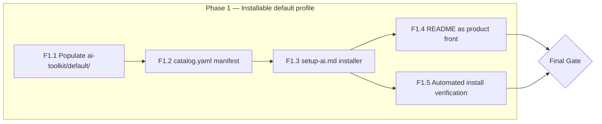
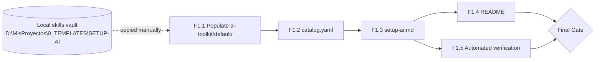

> [!abstract] Metadata
> | | |
> |---|---|
> | **Status** | 🟢 Done |
> | **Owner** | Carlos |
> | **Created** | 2026-08-01 |
> | **Updated** | 2026-08-01 |
> | **Version** | v0.1 |
> | **Parent specs** | [[product-spec]] · [[tech-spec]] |
> | **Scope** | Single feature phase: populate the distributable catalog, ship the `setup-ai` installer, and finish the README |

## 🎯 Vision

This roadmap covers a single feature phase: populate the distributable `ai-toolkit/default/` catalog, ship `setup-ai.md` supporting both installation methods for Claude Code and Codex CLI (best-effort), and finish the README as the project's front door. There are no prior PoCs blocking the start. The milestone closes when an automated check confirms a dummy-repo install lands every catalog file unmodified.

## 📊 Overview

## 🚀 Phase 1 — Installable default profile

This phase delivers the whole product as scoped for v1: a populated `default` profile catalog, the `setup-ai` installer (Claude Code native, Codex CLI best-effort), and a README that lets someone else install the kit unassisted.

| # | Feature | Depends on | Status | Notes |
|---|---|---|---|---|
| F1.1 | Populate `ai-toolkit/default/commands/` + `ai-toolkit/default/agents/` | — | ✅ Done | Copied from the maintainer's local skills vault (`D:\MisProyectos\0_TEMPLATES\SETUP-AI`), not authored from scratch (ADR-005) |
| F1.2 | `catalog.yaml` manifest | F1.1 | ✅ Done | Declares the `default` profile: skill/agent list and source paths (ADR-003) |
| F1.3 | `setup-ai.md` installer | F1.2 | ✅ Done | One-liner + copy-paste methods; always asks profile and target agent (ADR-004); fetches and writes, translating to Codex format at install time when needed (ADR-002) |
| F1.4 | README as product front | F1.3 | ✅ Done | Presents the kit, both install methods, and the `default` profile catalog |
| F1.5 | Automated install verification check | F1.3 | ✅ Done | Installs into a dummy/scratch folder and confirms every catalog file was copied unmodified |

**Phase 1 closing criterion** — F1.5's automated check runs against a dummy folder using both install methods with Claude Code as the target, and confirms every file declared in `catalog.yaml` for the `default` profile was installed and matches its `ai-toolkit/default/` source unmodified. The same check is attempted against Codex CLI at least once and its result documented, without blocking the gate if it fails (best-effort per ADR-002).

## 🔗 Dependency Graph

## ✅ Gates

### Gate Final Milestone — ✅ Met

- ✅ F1.1 through F1.4 complete and merged to `main`.
- ✅ F1.5's automated check passes for a dummy-folder install via both the one-liner and copy-paste methods against Claude Code.
- ✅ The same check has been run at least once against Codex CLI (best-effort; a failure does not block the gate per ADR-002 and Known Limitations, but must be documented).
- ✅ The README alone is sufficient for someone other than Carlos to reproduce a clean install without extra context.

## 🚫 Out of Roadmap

- **Additional profiles beyond `default`** — Future ([[product-spec]]).
- **Verified Codex CLI support** (beyond best-effort) — Future ([[product-spec]]).
- **Support for other AI agents** (Devin, Cursor, Windsurf, etc.) — Out of scope / Future ([[product-spec]]).
- **Per-skill granular versioning or rollback** — Out of scope ([[product-spec]]).
- **Catalog version notifications** — Future ([[product-spec]]).
- **Automated CI/CD or automated pre-publish testing** — Out of scope for this phase; validation stays manual per [[tech-spec]] Known Limitations.
