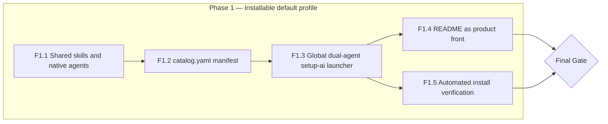
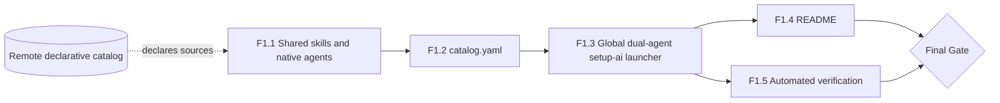

> [!abstract] Metadata
> | | |
> |---|---|
> | **Status** | 🟢 Done |
> | **Owner** | Carlos |
> | **Created** | 2026-08-01 |
> | **Updated** | 2026-08-08 |
> | **Version** | v0.1 |
> | **Parent specs** | [[product-spec]] · [[tech-spec]] |
> | **Scope** | Completed evolution: global dual-agent `setup-ai` launcher for Claude Code and Codex, declarative remote catalog, shared `ai-toolkit/skills/`, native agents in `ai-toolkit/agents/claude/` and `ai-toolkit/agents/codex/`, literal copying, ASCII confirmation, single authorization, preflight without partial installation, and post-copy detection |

## 🎯 Vision

This roadmap records the completed evolution from the initial distributable catalog into a global dual-agent `setup-ai` launcher backed by a declarative remote catalog. Skills now have one shared source in `ai-toolkit/skills/`; agents remain native in `ai-toolkit/agents/claude/` and `ai-toolkit/agents/codex/`. Installation fetches the catalog and artifacts, presents an ASCII confirmation, performs a preflight for both agents before a single authorization, copies sources literally, and verifies that each agent detects its installed skill. There are no prior PoCs blocking the start. The milestone closes when an automated check confirms a dummy-repo install lands every declared source byte-for-byte.

## 📊 Overview

## 🚀 Phase 1 — Installable default profile

This phase delivers the completed product evolution: a declarative remote catalog, shared skills with native agent artifacts, and a global dual-agent `setup-ai` launcher that installs the selected profile for Claude Code and Codex after one ASCII-confirmed authorization.

| # | Feature | Depends on | Status | Notes |
|---|---|---|---|---|
| F1.1 | Populate shared `ai-toolkit/skills/` + native `ai-toolkit/agents/claude/` and `ai-toolkit/agents/codex/` | — | ✅ Done | Skills have one distributable source; each agent keeps its native artifact and catalog routes (ADR-005) |
| F1.2 | `catalog.yaml` manifest | F1.1 | ✅ Done | Declares the `default` profile: skill/agent list and source paths (ADR-003) |
| F1.3 | Global dual-agent `setup-ai` launcher and embedded installer engine | F1.2 | ✅ Done | Detects Claude Code and Codex destinations before installation; shows an ASCII summary, requests one authorization, stops if either agent is absent to avoid partial installation, copies sources literally, and confirms post-copy skill detection (ADR-004) |
| F1.4 | README as product front | F1.3 | ✅ Done | Presents the kit, both install methods, and the `default` profile catalog |
| F1.5 | Automated install verification check | F1.3 | ✅ Done | Installs into a dummy/scratch folder and confirms every catalog file was copied unmodified |

**Phase 1 closing criterion** — F1.5's automated check runs against dummy destinations for both agents, confirms every source declared by the selected profile and agent in `catalog.yaml` was installed as a byte-for-byte copy, and verifies post-copy skill detection. Installation must stop before copying when either global agent destination is absent.

## 🔗 Dependency Graph

## ✅ Gates

### Gate Final Milestone — ✅ Met

- ✅ F1.1 through F1.4 complete and merged to `main`.
- ✅ F1.5's automated check passes for a dummy-folder install via both the one-liner and copy-paste methods against Claude Code.
- ✅ The same check has been run at least once against Codex CLI (best-effort; a failure does not block the gate per ADR-002 and Known Limitations, but must be documented).
- ✅ The README alone is sufficient for someone other than Carlos to reproduce a clean install without extra context.

## 🚫 Out of Roadmap

- **Additional profiles beyond `default`** — First one delivered: the `ui-ux` profile (superset of `default`, plus `ui-spec`/`clarify-uix` skills) shipped via specs/001-add-ui-ux-profile-with-new-ui-spec-and-clarify-uix. Further profiles beyond `ui-ux` remain Future ([[product-spec]]).
- **Additional Codex runtime validation** — Future ([[product-spec]]); native Codex support is present, but broader runtime coverage remains to be verified.
- **Support for other AI agents** (Devin, Cursor, Windsurf, etc.) — Out of scope / Future ([[product-spec]]).
- **Per-skill granular versioning or rollback** — Out of scope ([[product-spec]]).
- **Catalog version notifications** — Future ([[product-spec]]).
- **Automated CI/CD or automated pre-publish testing** — Out of scope for this phase; validation stays manual per [[tech-spec]] Known Limitations.
