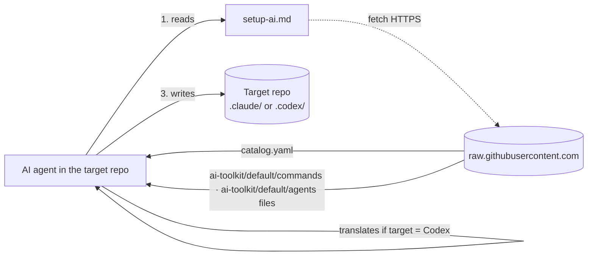
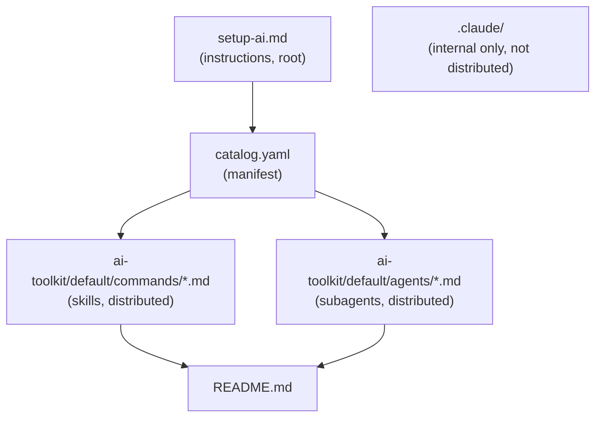
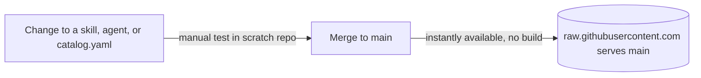

> [!abstract] Metadata
> | | |
> |---|---|
> | **Status** | 🟡 Draft |
> | **Owner** | Carlos |
> | **Created** | 2026-08-01 |
> | **Updated** | 2026-08-01 |
> | **Version** | v0.1 |
> | **ProductSpec** | [[product-spec]] |

## 📌 Scope

This document covers the technical installation mechanism (`setup-ai`) and the catalog format (skills and agents of the `default` profile) for Claude Code and, in best-effort mode, Codex CLI. The product's what and why are already defined in [[product-spec]]; this document only answers the how.

## 🧱 Tech Stack

| Component | Technology | Version | Rationale |
|-----------|------------|---------|-----------|
| Installer | Plain-text instructions (Markdown), interpreted and executed by the target AI agent with its own tools | — | Zero dependencies: no bash, Node, or any runtime required; portable across operating systems and agents |
| Catalog manifest | YAML (`catalog.yaml`) | — | Human-readable and easy for an LLM to parse; follows the same pattern as `reference.yaml` in the reference repo (FlorianBruniaux/claude-code-ultimate-guide) |
| Skills format — Claude Code | Markdown + YAML frontmatter (`ai-toolkit/default/commands/*.md`, Claude Code's native shape) | — | Matches the format Claude Code expects once copied into a target repo's `.claude/commands/` |
| Agents format — Claude Code | Markdown + YAML frontmatter with `tools`/`model` (`ai-toolkit/default/agents/*.md`, Claude Code's native shape) | — | Matches the format Claude Code expects once copied into a target repo's `.claude/agents/` |
| Skills format — Codex CLI | Folder with `SKILL.md` + YAML frontmatter (`.codex/skills/<name>/SKILL.md`) | — | Native format expected by Codex CLI; no subagent equivalent |
| File transport | HTTPS to `raw.githubusercontent.com` | — | No authentication, no token management, usable with any agent's native fetch tool |

> [!tip] No runtime dependencies
> There are no npm packages, gems, or binaries to install. The whole mechanism relies on the native fetch, read, and write tools of the AI agent running `setup-ai`.

> [!tip] Internal vs. distributed catalog
> This repo's own `.claude/commands` and `.claude/agents` are used only to develop my-aisy-toolkit itself (dogfooding the skills while building them) and are never fetched by `setup-ai`. The distributable catalog lives under `ai-toolkit/default/`, mirroring Claude Code's native file shape so it can be dropped as-is into a target repo's `.claude/`. Its content is populated from the maintainer's local skills vault (`D:\MisProyectos\0_TEMPLATES\SETUP-AI`), not authored from scratch in this repo.

## 🏗️ Module Design





#### `setup-ai.md` — Installation instructions

Natural-language guide an AI agent follows step by step to ask for profile and target agent, fetch the manifest and each file, and write them translated into the correct format.

#### `catalog.yaml` — Catalog manifest

Single root index declaring, per profile, which skills and agents it includes and their source path in this repo.

#### `ai-toolkit/default/commands/` — Skill catalog (`default` profile)

Distributable source of truth for the 12 skills of the `default` profile in Claude Code's native format, self-documented in their own frontmatter, fetched by `setup-ai`.

#### `ai-toolkit/default/agents/` — Subagent catalog (`default` profile)

Distributable source of truth for the 6 subagents of the `default` profile in Claude Code's native format, with `tools` and `model` declared in their frontmatter, fetched by `setup-ai`.

#### `.claude/` — Internal Claude Code setup (this repo only)

This repo's own commands/agents, used to develop my-aisy-toolkit itself; never read or fetched by `setup-ai` and not part of what gets installed elsewhere.

#### `README.md` — Project entry point

Presents the kit, documents both installation methods, and serves as the repo's "front" for anyone arriving for the first time.

## 🔄 Integration Mapping

| Internal operation | Method | External service | Notes |
|---------------------|--------|-------------------|-------|
| Fetch the manifest | GET (agent's native fetch) | `raw.githubusercontent.com/<org>/my-aisy-toolkit/main/catalog.yaml` | No authentication; fails if the repo becomes private or GitHub is unavailable |
| Fetch each skill/agent | GET (agent's native fetch) | `raw.githubusercontent.com/.../main/ai-toolkit/default/commands\|agents/*.md` | One request per file; no caching, every installation re-fetches all content |
| Translation to Codex format | Interpretation by the agent itself, no external service | — | The agent reads the Claude Code frontmatter and rewrites it as `SKILL.md`, following the instructions in `setup-ai.md` |

> [!warning] Anonymous GitHub rate limit
> Requests to `raw.githubusercontent.com` carry no authentication and share GitHub's unauthenticated per-IP rate limit. Profiles with many files could approach that limit on fast, consecutive installations.

## ⚠️ Error Handling

**Expected errors**

| Source | Error | Action | Description |
|--------|-------|--------|--------------|
| Manifest fetch | 404 / repo unreachable | Abort installation, inform the user | Without a manifest there's no way to know what to install |
| Skill/agent file fetch | 404 / timeout | Retry once; if it persists, inform and skip that file | Must not block installing the rest of the profile |
| Writing to target repo | File already exists with different content | Overwrite | Consistent with the "always the latest version" principle in [[product-spec]] |
| Target agent detection | User doesn't confirm Claude or Codex | Ask again; write nothing until answered | Prevents installing in the wrong format |

**Propagation**

There is no server or real HTTP status codes to propagate: the agent reports each error directly to the user in the conversation, in natural language, at the moment it occurs.

## 🩺 Healthcheck

Manual verification: compare the files present in `.claude/commands/` + `.claude/agents/` (or `.codex/skills/`) of the *target* repo against the list of skills/agents for the installed profile declared in `catalog.yaml` (which points at `ai-toolkit/default/` in this repo). There is no running process or endpoint to query.

## 📋 Logging

`setup-ai` does not generate persistent logs and uses no logging library. The agent reports in the conversation itself, in natural language, what it did with each file.

| Event | Level | Fields |
|-------|-------|--------|
| File installed | info | name, target path |
| File updated | info | name, target path, reason (content changed) |
| File skipped / fetch error | warning | name, reason |

## 🧪 Testing Strategy

**Unit Tests**

Not applicable: there is no executable code of its own, only Markdown/YAML content interpreted by the target agent.

**Integration Tests**

Prerequisite: an empty scratch repo. Flow verified manually before merging relevant changes to `catalog.yaml`, `setup-ai.md`, or the catalog: run both installation methods (one-liner and copy-paste) against Claude Code and, when possible, against Codex CLI, and confirm the files land in the correct location and format.

**Tools**

No persistent automated tooling in the repo. A temporary automated verification script was built and run once (evidence recorded in `specs/005-automated-install-verification-check/evidence.md`) to confirm the manual scratch-repo flow described above, then deleted by design. Manual verification remains the repeatable process, documented as a conscious limitation in Known Limitations.

## 🔌 Deployment



Build command:

```
None. There is no build step: content is served as-is from the main branch.
```

**Local development**

1. Edit the catalog, `setup-ai.md`, or `catalog.yaml` on a working branch.
2. In an empty scratch repo, ask the agent: `Fetch and follow the onboarding instructions from: https://raw.githubusercontent.com/<org>/my-aisy-toolkit/<branch>/setup-ai.md`, pointing at the test branch instead of `main`.
3. Verify the files are written to the correct location and format for the chosen profile and agent.

## 📦 Dependencies

**Runtime**

```
None.
```

**Dev**

```
None.
```

## 📐 ADRs (Architecture Decision Records)

### ADR-001: Plain-text instructions interpreted by the agent, not an executable script

**Decision**: `setup-ai` is a natural-language instructions file that the target AI agent reads and executes with its own tools, not a bash script or an npx package.

**Context**: A bash+curl one-liner and an npx wrapper were both evaluated. Both broke the zero-dependencies principle (they require bash or Node to be present) or left out Windows without WSL/Git Bash. The reference repo (FlorianBruniaux/claude-code-ultimate-guide) shows that a Markdown prompt, executed by the agent itself, works just as well and is OS-agnostic.

**Consequences**:
- (+) Works the same on any operating system and with any agent that can read instructions and fetch.
- (+) Zero maintenance surface for a script (no bash or Node versions to support).
- (-) Behavior depends on the agent correctly interpreting natural-language instructions; it's not deterministic like code.
- Mitigation: explicit, step-by-step instructions in `setup-ai.md`, manually verified in a scratch repo before publishing changes.

### ADR-002: Codex translation at install time, no pre-generated catalog

**Decision**: The repo only maintains the catalog in Claude Code's native format (`.claude/commands`, `.claude/agents`). The translation to `.codex/skills/*/SKILL.md` is done by the agent itself at install time, following the instructions in `setup-ai.md`.

**Context**: Maintaining both formats in parallel in the repo was considered. It was discarded because it would duplicate maintenance for every new skill, and because there is currently no way to test Codex in a real environment to verify a pre-generated version would be correct.

**Consequences**:
- (+) A single source of truth for the catalog; zero duplicated maintenance.
- (-) Higher risk of inconsistent or incorrect translations since they can't be validated against a real Codex before publishing.
- Mitigation: Codex support documented as best-effort in [[product-spec]]; reconsider a pre-generated catalog if Codex usage grows.

### ADR-003: `catalog.yaml` as an explicit catalog manifest

**Decision**: A single `catalog.yaml` at the repo root declares, per profile, which skills/agents it includes and their source path, instead of `setup-ai` dynamically listing remote directories.

**Context**: Having the agent list `.claude/commands/` and `.claude/agents/` directly via the GitHub API was considered. It was discarded because it depends on the agent having a tool to list remote directories (not all do), and because an explicit manifest lets profiles be defined independently of the repo's folder structure.

**Consequences**:
- (+) Explicit, versioned definition of what each profile contains, independent of folder structure.
- (+) Compatible with any agent that can only fetch a known URL.
- (-) Risk of the manifest drifting out of sync if a skill is added without updating it.
- Mitigation: the manual scratch-repo test (see Testing Strategy) must include checking that every new file in the profile appears in `catalog.yaml`.

### ADR-004: Target agent detection always by explicit question

**Decision**: `setup-ai` always asks the user whether the target is Claude Code or Codex CLI, instead of inferring it from folders already present in the target repo.

**Context**: A heuristic based on whether `.claude/` or `.codex/` already exists in the target repo was considered. It was discarded as the sole mechanism because a first installation (clean repo) has no signal to detect at all, and a silent heuristic could write in the wrong format without the user noticing.

**Consequences**:
- (+) Zero ambiguity: the wrong format is never written due to a failed detection.
- (-) One extra question even on re-installs where the context was already obvious.

### ADR-005: Distributable catalog lives under `ai-toolkit/default/`, decoupled from this repo's own `.claude/`

**Decision**: The catalog that `setup-ai` fetches lives at `ai-toolkit/default/commands/` and `ai-toolkit/default/agents/`. This repo's own `.claude/commands` and `.claude/agents` (used to develop the toolkit itself with its own skills) are a separate, internal-only copy, never read by `setup-ai`.

**Context**: Reusing this repo's own `.claude/` directly as the fetched catalog was considered, since its content currently matches the `default` profile. It was discarded because it would couple what the maintainer uses to work on this repo to what gets shipped to end users, making it ambiguous (for both humans and fetching agents) which files are "the product" versus internal tooling, and blocking the internal setup from diverging later without breaking installs.

**Consequences**:
- (+) Unambiguous single path (`ai-toolkit/default/`) for anything `setup-ai` may fetch; the internal `.claude/` can evolve freely.
- (-) The `default` profile catalog must be kept manually in sync with its canonical source (the maintainer's local skills vault) instead of being read live from `.claude/`.

## ⚠️ Known Limitations

- No persistent automated tests or CI/CD: validation is normally manual, in a scratch repo, before publishing changes to main. A one-off automated verification script (`scripts/verify-install-temp.ps1`) was built and run once to confirm this manual process (see `specs/005-automated-install-verification-check/evidence.md`), then deleted by design — there is no repeatable automated tooling checked into the repo.
- Codex CLI support is best-effort: it hasn't been possible to verify it in a real Codex environment.
- The `ai-toolkit/default/` catalog has no automated sync with its canonical source (the maintainer's local skills vault at `D:\MisProyectos\0_TEMPLATES\SETUP-AI`); updates are copied over by hand.
- Requests to `raw.githubusercontent.com` are anonymous and subject to GitHub's unauthenticated rate limit.
- Correct installation depends on the target agent faithfully following the natural-language instructions in `setup-ai.md`; there's no deterministic behavior guarantee like with a script.

## ❓ Discovery

- [x] ~~Will `catalog.yaml` need to be split into several files if the number of profiles or skills grows a lot?~~ → No: profiles are not expected to grow that much for now; a single `catalog.yaml` is assumed sufficient.
