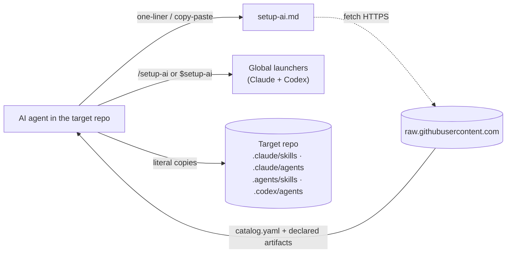
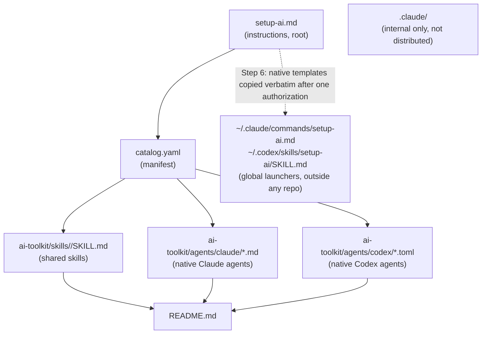
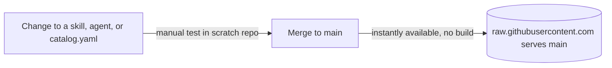

> [!abstract] Metadata
> | | |
> |---|---|
> | **Status** | 🟡 Draft |
> | **Owner** | Carlos |
> | **Created** | 2026-08-01 |
> | **Updated** | 2026-08-08 |
> | **Version** | v0.1 |
> | **ProductSpec** | [[product-spec]] |

## 📌 Scope

> **Current catalog architecture.** `ai-toolkit/skills/<name>/SKILL.md` is the sole distributable skill source and is copied byte-for-byte. Native agents are stored independently at `ai-toolkit/agents/claude/*.md` and `ai-toolkit/agents/codex/*.toml`; `catalog.yaml` supplies all literal paths. Any older passage below that describes command-folder distribution or runtime translation is historical context superseded by ADR-002.

This document covers the technical installation mechanism (`setup-ai`) and the catalog format (skills and agents, currently spanning the `default` and `ui-ux` profiles, plus optional non-profile packs such as `utils`) for Claude Code and, in best-effort mode, Codex CLI. The product's what and why are already defined in [[product-spec]]; this document only answers the how.

## 🧱 Tech Stack

| Component | Technology | Version | Rationale |
|-----------|------------|---------|-----------|
| Installer | Plain-text instructions (Markdown), interpreted and executed by the target AI agent with its own tools | — | Zero dependencies: no bash, Node, or any runtime required; portable across operating systems and agents |
| Catalog manifest | YAML (`catalog.yaml`) | — | Human-readable and easy for an LLM to parse; follows the same pattern as `reference.yaml` in the reference repo (FlorianBruniaux/claude-code-ultimate-guide) |
| Shared skills | `ai-toolkit/skills/<name>/SKILL.md` | — | One distributable artifact, copied literally to the selected platform's skills directory; no translation |
| Agents — Claude Code | Markdown (`ai-toolkit/agents/claude/*.md`) | — | Native Claude agent artifacts, copied literally to `.claude/agents/` |
| Agents — Codex | TOML (`ai-toolkit/agents/codex/*.toml`) | — | Native Codex agent artifacts, copied literally to `.codex/agents/` |
| File transport | HTTPS to `raw.githubusercontent.com` | — | No authentication, no token management, usable with any agent's native fetch tool |

> [!tip] No runtime dependencies
> There are no npm packages, gems, or binaries to install. The whole mechanism relies on the native fetch, read, and write tools of the AI agent running `setup-ai`.

> [!tip] Internal vs. distributed catalog
> This repo's own local configuration is not a distribution source. The distributable catalog is explicit: shared skills live only in `ai-toolkit/skills/<name>/SKILL.md`, while native agents live in their platform-specific directories. `catalog.yaml` declares every source path literally; no profile-folder convention, remote directory listing, or runtime conversion determines installed content.

## 🏗️ Module Design



The copy-paste route follows `setup-ai.md`. Step 6 installs the two native global launchers together after one explicit authorization; their only purpose is to make the same maintenance workflow available from any repository.



#### `setup-ai.md` — Installation instructions

Natural-language guide an AI agent follows step by step to ask for profile and target agent, fetch the manifest and each declared artifact, and copy it literally to the target-native destination. Its Step 6 also contains the native global-launcher templates and their dual-installation contract.

#### Global launcher — user-level command

Paired user-level shortcuts, written outside any repo so the user can run `setup-ai` from anywhere to update or reinstall skills. Step 6 always targets both detected agents; it is not a local-repository launcher or a self-updating template mechanism.

| Target agent | Path | Format | Invoked as |
|---|---|---|---|
| Claude Code | `~/.claude/commands/setup-ai.md`, when `~/.claude/` is detected | Markdown + frontmatter (`description`, `argument-hint`), same shape as any user-level slash command | `/setup-ai` |
| Codex CLI | `~/.codex/skills/setup-ai/SKILL.md`, or `~/.agents/skills/setup-ai/SKILL.md` only when `.codex/` is absent and `.agents/` is detected | Folder with `SKILL.md` + frontmatter (`name`, `description`) | `$setup-ai` |

Before writing, Step 6 shows an ASCII panel explaining `setup-ai`, its dual global availability and its use from any repository, then requests one authorization only. It preflights both agent roots and aborts the entire global operation if either is missing: it never offers a partial installation. It copies each native template byte-for-byte, treating identical existing content as unchanged, and verifies the exact path, bytes and recognizable native shape afterwards. If a runtime discovery check is available, it is attempted; otherwise the limitation is reported rather than claiming executable discoverability. Catalog artifacts and launcher templates are copied literally, never translated.

#### `catalog.yaml` — Catalog manifest

Single root index declaring, for each profile and optional pack, the included skills and native agents plus each artifact's explicit source path in this repository.

#### `ai-toolkit/skills/` — Shared skill catalog

Distributable source of truth for all shared skills. Each skill is a single `ai-toolkit/skills/<name>/SKILL.md` artifact referenced explicitly by `catalog.yaml` and copied byte-for-byte to `.claude/skills/<name>/SKILL.md` or `.agents/skills/<name>/SKILL.md`.

#### `ai-toolkit/agents/` — Native agent catalog

Native source of truth for agents: Claude Markdown in `ai-toolkit/agents/claude/*.md` is installed literally in `.claude/agents/`; Codex TOML in `ai-toolkit/agents/codex/*.toml` is installed literally in `.codex/agents/`. `catalog.yaml` decides which explicit artifacts belong to each selected profile or pack.

#### `.claude/` — Internal Claude Code setup (this repo only)

This repo's own commands/agents, used to develop my-aisy-toolkit itself; never read or fetched by `setup-ai` and not part of what gets installed elsewhere.

#### `README.md` — Project entry point

Presents the kit, documents both installation methods, and serves as the repo's "front" for anyone arriving for the first time.

## 🔄 Integration Mapping

| Internal operation | Method | External service | Notes |
|---------------------|--------|-------------------|-------|
| Global launcher invocation (`/setup-ai`, `$setup-ai`) | Native command/skill installed by Step 6 | Local user-level agent directory | Invokes the maintenance instructions from any repository; Step 6 does not self-update launcher templates |
| Global launcher installation (Step 6) | Preflight, one authorization, literal copies and post-copy checks | Claude and Codex user-level directories | Requires both detected roots before either write; identical content is unchanged, otherwise the native template is updated or created |
| Fetch the manifest | GET (agent's native fetch) | `raw.githubusercontent.com/<org>/my-aisy-toolkit/main/catalog.yaml` | No authentication; fails if the repo becomes private or GitHub is unavailable |
| Fetch each declared artifact | GET (agent's native fetch) | `raw.githubusercontent.com/.../main/ai-toolkit/skills/<name>/SKILL.md`, `ai-toolkit/agents/claude/*.md`, or `ai-toolkit/agents/codex/*.toml` | One request per manifest-declared file; the artifact is copied literally to its target-native destination |
| Install shared skill | Literal file copy | Target repo | `.claude/skills/<name>/SKILL.md` for Claude; `.agents/skills/<name>/SKILL.md` for Codex |
| Install native agent | Literal file copy | Target repo | `.claude/agents/*.md` for Claude; `.codex/agents/*.toml` for Codex |

> [!warning] Anonymous GitHub rate limit
> Requests to `raw.githubusercontent.com` carry no authentication and share GitHub's unauthenticated per-IP rate limit. Profiles with many files could approach that limit on fast, consecutive installations.

## ⚠️ Error Handling

**Expected errors**

| Source | Error | Action | Description |
|--------|-------|--------|--------------|
| Manifest fetch | 404 / repo unreachable | Abort installation, inform the user | Without a manifest there's no way to know what to install |
| Skill/agent file fetch | 404 / timeout | Retry once; if it persists, inform and skip that file | Must not block installing the rest of the profile |
| Writing to target repo | File already exists | Compare source and destination; update only if different | The installer reports unchanged, updated, or newly installed artifacts; it never translates their contents |
| Target agent detection | User doesn't confirm Claude or Codex | Ask again; write nothing until answered | Prevents installing in the wrong format |
| Global launcher preflight (Step 6) | Claude, Codex or both agent roots are absent | Stop before confirmation and before any write; identify every missing root and tell the user to install or initialize that agent | No partial global installation is offered |
| Global launcher copy or verification (Step 6) | Permission denied, missing subdirectory, byte/shape mismatch, or discovery check fails | Report the affected agent, destination and concrete result; do not delete either copy | If runtime discovery is unavailable, report structural verification as the limit instead of claiming discoverability |

**Propagation**

There is no server or real HTTP status codes to propagate: the agent reports each error directly to the user in the conversation, in natural language, at the moment it occurs. For Step 6, the dual-root preflight, single authorization and post-copy diagnostics above supersede the previous optional/local-launcher behavior.

## 🩺 Healthcheck

Manual verification: compare the files in `.claude/skills/` + `.claude/agents/` (Claude) or `.agents/skills/` + `.codex/agents/` (Codex) against the literal artifact paths selected in `catalog.yaml`. Confirm each installed file is byte-for-byte equal to its catalog source. For Step 6, verify both detected global destinations, their native command/skill shape, their bytes and any discovery check exposed by the active agent session. There is no running process or endpoint to query.

## 📋 Logging

`setup-ai` does not generate persistent logs and uses no logging library. The agent reports in the conversation itself, in natural language, what it did with each file.

| Event | Level | Fields |
|-------|-------|--------|
| File installed | info | name, target path |
| File updated | info | name, target path, reason (content changed) |
| File skipped / fetch error | warning | name, reason |

## 🧪 Testing Strategy

**Unit Tests**

Not applicable: there is no executable code of its own, only Markdown/YAML content interpreted by the target agent.

**Integration Tests**

Prerequisite: an empty scratch repo. Flow verified manually before merging relevant changes to `catalog.yaml`, `setup-ai.md`, or the catalog: run both installation methods (one-liner and copy-paste) against Claude Code and, when possible, against Codex CLI, and confirm the files land in the correct location and format.

The global launchers (Step 6) are verified in the same run using a temporary HOME: confirm the ASCII explanation, exactly one authorization, both roots detected before writes, no writes when either root is missing, byte-for-byte native copies, idempotent re-runs and post-copy structure/bytes checks. From a second scratch repository, invoke the launcher for both agents and use the discovery check when the active session exposes one; otherwise record that execution discoverability could not be asserted. For both agents, verify literal skill and agent contents and the destinations `.claude/skills`, `.claude/agents`, `.agents/skills`, and `.codex/agents` as applicable.

> [!warning] Never verify the launcher against the real home directory
> Testing Step 6 **must** be done with `HOME` pointed at a throwaway scratch directory, never against the maintainer's real `~/.claude/` or `~/.codex/`. There is already a legacy, unrelated `~/.claude/commands/setup-ai.md` on that machine, and nothing in this flow may write, overwrite, move, or delete anything there. A test that touches the real home is a failed test, whatever its result.

**Tools**

No persistent automated tooling in the repo. A temporary automated verification script was built and run once (evidence recorded in `specs/005-automated-install-verification-check/evidence.md`) to confirm the manual scratch-repo flow described above, then deleted by design. Manual verification remains the repeatable process, documented as a conscious limitation in Known Limitations.

## 🔌 Deployment



Build command:

```
None. There is no build step: content is served as-is from the main branch.
```

**Local development**

1. Edit shared skills, native agents, `setup-ai.md`, or `catalog.yaml` on a working branch.
2. In an empty scratch repo, ask the agent: `Fetch and follow the onboarding instructions from: https://raw.githubusercontent.com/<org>/my-aisy-toolkit/<branch>/setup-ai.md`, pointing at the test branch instead of `main`.
3. Verify the files are written literally to the correct skill and agent locations for the chosen profile and agent, then exercise the global dual-launcher preflight, idempotency and post-copy diagnostic paths with a temporary HOME.

## 📦 Dependencies

**Runtime**

```
None.
```

**Dev**

```
None.
```

No npm/package-manager dependency was added, but the repo does rely on the GitHub Actions platform itself (built-in `pull_request`/`push` triggers, default `GITHUB_TOKEN`, no third-party marketplace actions) for `pr-title-check.yml` and `publish-version-tag.yml`.

## 📐 ADRs (Architecture Decision Records)

### ADR-001: Plain-text instructions interpreted by the agent, not an executable script

**Decision**: `setup-ai` is a natural-language instructions file that the target AI agent reads and executes with its own tools, not a bash script or an npx package.

**Context**: A bash+curl one-liner and an npx wrapper were both evaluated. Both broke the zero-dependencies principle (they require bash or Node to be present) or left out Windows without WSL/Git Bash. The reference repo (FlorianBruniaux/claude-code-ultimate-guide) shows that a Markdown prompt, executed by the agent itself, works just as well and is OS-agnostic.

**Consequences**:
- (+) Works the same on any operating system and with any agent that can read instructions and fetch.
- (+) Zero maintenance surface for a script (no bash or Node versions to support).
- (-) Behavior depends on the agent correctly interpreting natural-language instructions; it's not deterministic like code.
- Mitigation: explicit, step-by-step instructions in `setup-ai.md`, manually verified in a scratch repo before publishing changes.

### ADR-002: Shared skills and native agents

**Decision**: Each distributable skill exists once at `ai-toolkit/skills/<name>/SKILL.md` and is copied byte-for-byte to either agent's native skill destination. Agents remain native artifacts: Claude Markdown under `ai-toolkit/agents/claude/` and Codex TOML under `ai-toolkit/agents/codex/`.

**Context**: Runtime translation made installs non-deterministic. A shared `SKILL.md` preserves a single skill source without asking the installer to reinterpret it, while agents retain the formats their platforms require.

**Consequences**:
- (+) Reproducible, byte-for-byte skill installation for both platforms.
- (+) Deliberate agent differences are explicit and independently reviewable.
- (-) Maintainers must keep the manifest coverage current.
- Mitigation: `AGENTS.md` is the maintenance source of truth and PR review checks `default`, `ui-ux`, and `utils` coverage.

### ADR-003: `catalog.yaml` as an explicit catalog manifest

**Decision**: A single `catalog.yaml` at the repo root declares every profile and pack artifact with its literal source path: shared skills under `ai-toolkit/skills/<name>/SKILL.md`, Claude agents under `ai-toolkit/agents/claude/*.md`, and Codex agents under `ai-toolkit/agents/codex/*.toml`. The installer never derives paths from a profile-folder convention or dynamically lists remote directories.

**Context**: Having the agent list `.claude/commands/` and `.claude/agents/` directly via the GitHub API was considered. It was discarded because it depends on the agent having a tool to list remote directories (not all do), and because an explicit manifest lets profiles be defined independently of the repo's folder structure.

**Consequences**:
- (+) Explicit, versioned definition of what each profile contains, including platform-native agent variants.
- (+) Compatible with any agent that can only fetch a known URL.
- (-) Risk of the manifest drifting out of sync if a skill is added without updating it.
- Mitigation: the manual scratch-repo test (see Testing Strategy) must include checking that every new file in the profile appears in `catalog.yaml`.

### ADR-004: Target agent detection always by explicit question

**Decision**: `setup-ai` always asks the user whether the target is Claude Code or Codex CLI, instead of inferring it from folders already present in the target repo.

**Context**: A heuristic based on whether `.claude/` or `.codex/` already exists in the target repo was considered. It was discarded as the sole mechanism because a first installation (clean repo) has no signal to detect at all, and a silent heuristic could write in the wrong format without the user noticing.

**Consequences**:
- (+) Zero ambiguity: the wrong format is never written due to a failed detection.
- (-) One extra question even on re-installs where the context was already obvious.

### ADR-005: Shared skills and native agents are separate distributable artifacts

**Decision**: Distributable skills exist only once under `ai-toolkit/skills/<name>/SKILL.md` and are copied byte-for-byte to either platform. Agents are maintained as separate native artifacts under `ai-toolkit/agents/claude/` and `ai-toolkit/agents/codex/`. This repo's local `.claude/` configuration is internal-only and never read by `setup-ai`.

**Context**: Reusing local `.claude/` files or translating one platform's artifacts at install time would couple development tooling to distribution and make output dependent on agent interpretation. Both were discarded in favor of one literal skill source and explicit native agent variants.

**Consequences**:
- (+) Skills install reproducibly and identically on both platforms, without translation.
- (+) Native agent differences are explicit and reviewable.
- (-) Maintainers must update the explicit manifest when adding or moving an artifact.

### ADR-006: Repo-level SemVer via PR-title-driven GitHub Actions and git tags, decoupled from catalog distribution

**Decision**: The repo adopts Semantic Versioning at the repository level: there is no `VERSION` file — the git tag `vX.Y.Z` is the sole source of truth — plus a `CHANGELOG.md` following [Keep a Changelog](https://keepachangelog.com/), still hand-maintained. The tag is computed and pushed automatically by `.github/workflows/publish-version-tag.yml` (via `.github/scripts/compute-next-tag.sh`) from the prefix of the PR title that was just merged to `main`, following the table in `CLAUDE.md` (`release:`→major, `feature:`→minor, `fix:`→patch, `chore:`→no tag). That prefix is validated up front by `.github/workflows/pr-title-check.yml`, a required status check that blocks the merge of any PR whose title doesn't start with one of those four prefixes. The tag is surfaced by a dynamic shields.io badge (`img.shields.io/github/v/tag/...`) in both `README.md` and `README-ES.md`, replacing the previous hand-maintained static badge.

**Context**: Two distinct things could be called "versioning" here, and only one of them changes. (a) *Catalog distribution versioning* — unchanged: `setup-ai` always fetches `main`, there is no version selection for the end user and no SemVer involved in installing or re-installing, exactly as [[product-spec]] states ("always the latest version"); change detection keeps comparing content directly, never version numbers. (b) *Repo versioning* — new, and its only purpose is maintainer visibility: knowing at a glance which state the catalog is in without reading the commit history. Two alternatives that would have collapsed that distinction were discarded: adding a `version` field to `catalog.yaml`, or to each skill's/agent's frontmatter. Both push version numbers into the distribution path, turn every catalog edit into a per-file bump, and invite `setup-ai` to compare versions instead of content — while ADR-003 keeps `catalog.yaml` as a pure "what's in each profile" manifest. Publishing GitHub Releases and pointing the badge at the `/github/v/release/` endpoint was also considered and discarded for now: it adds a publishing step to every release without adding information that plain tags don't already carry; it is left as a possible future improvement if releases ever need attached notes or assets.

**Consequences**:
- (+) The repo's version is visible on the front page and traceable in `CHANGELOG.md`, with no manual badge editing to keep in sync.
- (+) The installation path is untouched: no `version` field enters `catalog.yaml` or any catalog file, so nothing about what users get changes.
- (-) The topmost `CHANGELOG.md` entry can still drift out of sync with the latest git tag, since `CHANGELOG.md` remains hand-maintained while the tag itself is now computed and pushed automatically; there is no `VERSION` file left for either of them to drift from.
- Mitigation: keep adding the version entry to `CHANGELOG.md` as part of the PR that triggers the tag-bumping merge (see the automated process below).
- (-) Until the first tag exists in the repo, the badge renders as "version | no tags found" in red on both READMEs (verified against the shields.io API); it does not break the layout, but it does look like an error.
- Mitigation: `publish-version-tag.yml` publishes the first tag automatically on the first qualifying merge to `main` (`v0.1.0` for the first `feature:`/`fix:`, `v1.0.0` for the first `release:`), no manual step required.
- (-) `github/v/tag` without `sort=semver` picks the most recently created tag, not the highest SemVer, so an out-of-order tag (e.g. a `v0.1.1` hotfix cut after `v0.2.0`) would show the wrong version.
- Mitigation: harmless while releases stay strictly linear; revisit the badge query if maintenance branches ever appear.

**Release process (automated via GitHub Actions)**: the maintainer's whole "release step" is opening a PR titled with the correct prefix (`release:`/`feature:`/`fix:`/`chore:`, case-insensitive, per the table in `CLAUDE.md`). `pr-title-check.yml` runs as a required status check on `opened`/`edited`/`synchronize` and blocks the merge of any PR whose title doesn't start with one of those prefixes. On merge to `main`, `publish-version-tag.yml` reads the merged PR's title prefix and the latest existing `vX.Y.Z` tag, computes the next tag via `.github/scripts/compute-next-tag.sh`, and pushes it — no manual `VERSION` bump, no manual `git tag`/`git push`, and no GitHub Release created. `CHANGELOG.md` remains hand-maintained and is not touched by either workflow.

### ADR-007: Dual global launchers with one authorization and no self-update

**Decision**: Step 6 installs native global launchers for both Claude Code and Codex only after one explicit authorization. It first requires both agent roots to be detected, then copies the native templates byte-for-byte, preserves identical files without rewriting them, and performs post-copy structural, byte and available discovery checks. It does not use template self-update or a local-repository launcher.

**Supersession**: The historical context and consequences below describe the replaced embedded/self-updating launcher proposal. The operative contract is the dual global installation stated in this decision and in Module Design, Error Handling, Healthcheck and Testing Strategy.

**Context**: A local-only launcher and separate per-agent confirmations would make the maintenance command harder to understand and use. A partial global installation was rejected because it leaves an ambiguous, asymmetric state. Creating agent roots merely to satisfy detection was also rejected: a real Claude or Codex installation must already provide its own root. The only permitted user-level writes are the two known native destinations after the dual preflight and one authorization.

**Consequences**:
- (+) One visual explanation and one authorization establish the same global maintenance capability for both agents.
- (+) The preflight prevents a half-installed state and preserves existing files when their bytes are already identical.
- (+) Post-copy structural and available discovery checks make failures diagnosable without destructive rollback.
- (-) The global operation cannot proceed if either agent root is absent, even when the other agent is available.
- Mitigation: identify every missing agent root and instruct the user to install or initialize it, then rerun `setup-ai`.
- (-) Runtime discoverability depends on commands exposed by the active agent session.
- Mitigation: report a structural-only verification result when no discovery command is available; never claim an unperformed runtime check passed.

## ⚠️ Known Limitations

- No persistent automated tests or CI/CD for `setup-ai`'s own install-flow: validation of what gets installed and in what format is normally manual, in a scratch repo, before publishing changes to main. A one-off automated verification script (`scripts/verify-install-temp.ps1`) was built and run once to confirm this manual process (see `specs/005-automated-install-verification-check/evidence.md`), then deleted by design — there is no repeatable automated tooling checked into the repo for this purpose. The repo does now have CI/CD for a different, unrelated purpose — PR title validation (`.github/workflows/pr-title-check.yml`, required status check) and automated version-tag publishing (`.github/workflows/publish-version-tag.yml`) — but neither of those tests or verifies `setup-ai`'s installation behavior.
- Codex CLI support is best-effort: it hasn't been possible to verify it in a real Codex environment.
- Shared skills and each platform's native agents are maintained manually; changes require keeping their explicit `catalog.yaml` entries current.
- Requests to `raw.githubusercontent.com` are anonymous and subject to GitHub's unauthenticated rate limit.
- Correct installation depends on the target agent faithfully following the natural-language instructions in `setup-ai.md`; there's no deterministic behavior guarantee like with a script.
- The global launcher's Codex CLI destination (`~/.codex/skills/setup-ai/SKILL.md`, fallback `~/.agents/skills/setup-ai/SKILL.md`) has **not** been verified against a real Codex CLI install — official docs point at `~/.agents/skills`, while the binary and community sources also use `~/.codex/skills`. If the choice is wrong, the file is inert (Codex simply won't list `$setup-ai`), not destructive. Best-effort like the rest of Codex support (ADR-002, ADR-007).
- The global launchers do not self-update. Updating or reinstalling the toolkit is an explicit `setup-ai` maintenance action, not a background template refresh.
- Step 6 can verify the two written files, their bytes and native shape in a temporary HOME, but executable discovery/invocation is only asserted when the active Claude or Codex session exposes a supported discovery check. It reports that limitation explicitly rather than treating it as a successful runtime check.

## ❓ Discovery

- [x] ~~Will `catalog.yaml` need to be split into several files if the number of profiles or skills grows a lot?~~ → No: profiles are not expected to grow that much for now; a single `catalog.yaml` is assumed sufficient.
